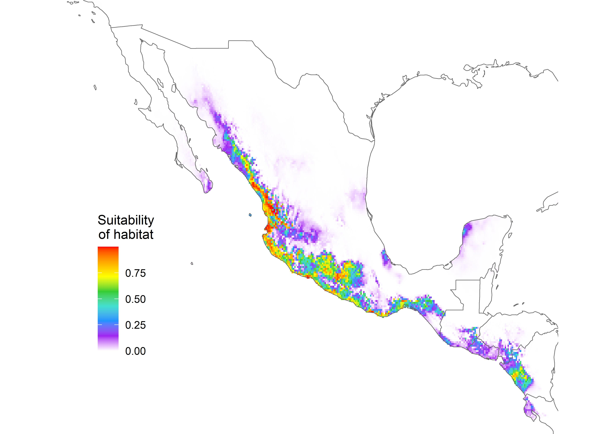

```{r setup, include=FALSE}
knitr::opts_chunk$set(echo = FALSE,
                      eval = FALSE,
                      warning = FALSE,
                      message = FALSE)

library(rasterVis)
library(tidyverse)
library(raster)
library(maps)
library(here)
library(janitor)

```

## Summary

Species distribution modeling (SDM) is a spatial tool that enables us to predict past, current, and future species distributions. Here, I SDM in [Maxent](https://biodiversityinformatics.amnh.org/open_source/maxent/) to model the niche changes of a Mexican lowland bird using collections data from the [Moore Laboratory of Zoology](https://moorelab.oxy.edu/).


## Background

As climate changes, the ranges of both highland and lowland bird species in Mexico are expected to shift. To understand shifts in range, the current range must first be determined. This investigation utilizes distribution modeling to determine the current niche of the lowland species *Melanerpes chrysogenys*.

*M. chrysogenys*, or the Golden-cheeked woodpecker, is a lowland bird species endemic to Mexico. They are non-migratory and live in partially-open areas with patches of trees, arid or semi-humid forests, and plantations (Cornell Lab of Ornithology). *M. chrysogenys* nest in cardon hecho cactus (*Pachycereus pecten-aboriginum*), found in the tropical dry forests of Mexico (McBride *et al.*, 2012). Past modeling indicates that they are most likely to make their home along the narrow strip of lowlands along Mexico's west coast (Ortega-Huerta and Townsend Peterson, 2008). SDM is expected to predict a current distribution for the species that follows the lowlands along the west coast of Mexico, consistent with the findings of Ortega-Huerta and Townsend Peterson (2008).

## Data

### Collections location data

The data I utilized are available for open source download on the ARCTOS database. To use them in Maxent, I rearranged them to include only latitude and longitude values. The observed locations of *M. chrysogenys* in Mexico are along the lowlands of the western coast (Figure 1). However, point locations of observations can not give a holistic picture of the distribution of the species which is where SDM comes in.

```{r sp}

mchrys_locs <- read_csv(here("data/Mchriso.csv")) %>% 
  clean_names()
  rename("lon" = "dec_lon",
         "lat" = "dec_lat") %>% 
    mutate(species = "Mchriso") %>% 
    select(lon, lat, species) %>% 
    unique() %>% 
    na.omit()
  

# save to use in maxent
write_csv(m.chrysogenys, "mchrys_locs.csv")

# political boundaries
world <- map_data("world")

```


```{r obs map}
ggplot()+
  geom_polygon(data = world, 
               aes(x = long, y = lat, group = group), 
               color = 'grey40', 
               fill = 'transparent', size = 0.25) +
  geom_point(data = mchrys_locs,
             aes(x = long, y = lat), 
             size = 2, alpha = 0.75) +
  theme_void()+
  coord_fixed(xlim = c(-120, -85),  
              ylim = c(10, 33), 
              ratio = 1.3)
```


### Environmental data

Predictor variables for area of the map extent are necessary to utilize SDM. I used the Bioclim environmental variables are a useful set of 19 predictors including precipitation seasonality, temperature, and rainfall. Below are maps visualizing precipitation seasonality (Figure 2) and mean annual temperature (Figure 3) in Mexico.

```{r env}

predictors <- list.files(here("data/bioclim"),
                         full.names = TRUE,
                         pattern = ".asc") %>% 
  raster::stack()

env_color <- c('white', 'purple', "dodgerblue", 
               'turquoise', 'limegreen', 'yellow', 
               'orange', 'red')

```

```{r precip}
##MAP_15
gplot(predictors[["bio_15"]], maxpixels = 100000) +
  geom_tile(aes(fill = value))+
  scale_fill_gradientn(colors = env_color,
                       na.value ='transparent',
                       name = "Precipitaion\nseasonality")+ 
  geom_polygon(data = world, 
               aes(x = long, y = lat, group = group),
               color = 'grey40', fill = 'transparent', 
               size = 0.25)+
  geom_point(data = mchrys_locs,
             aes(x = long, y = lat),
             shape = 1, size = 3, 
             color = "black") +
  theme_void()+
  coord_fixed(xlim = c(-120, -85),  
              ylim = c(10, 33),
              ratio = 1.3)+
  theme(legend.position = c(0.85, 0.75),
        legend.background = element_rect(fill="white",
                                         color = "white"),
        legend.title.align = 0.5)

```


```{r mat}
## Mean annual temperature

gplot(predictors[["bio_1"]], maxpixels = 100000) +
  geom_tile(aes(fill = value))+
  scale_fill_gradientn(colors = env_color,
                       na.value ='transparent',
                       name = "Mean annual\ntemperature\nindex")+ 
  geom_polygon(data = world, 
               aes(x = long, y = lat, group = group),
               color = 'grey40', fill = 'transparent', 
               size = 0.25)+
  geom_point(data = mchrys_locs,
             aes(x = long, y = lat),
             shape = 1, size = 3, 
             color = "black") +
  theme_void()+
  coord_fixed(xlim = c(-120, -85),  
              ylim = c(10, 33),
              ratio = 1.3)+
  theme(legend.position = c(0.85, 0.75),
        legend.background = element_rect(fill="white",
                                         color = "white"),
        legend.title.align = 0.5)

```


I extracted predictor variables at each observation location. It is not useful to include highly correlated variables, so I ran a pairwise comparison and pared the bioclim variables down manually based on the Pearson r correlation. 

```{r extract}
extract.data <- extract(predictors, m.chrysogenys.locs[,1:2]) # extract lat long

# Combine the observation data with the extracted data to see the full dataset
sp_data <- cbind(m.chrysogenys.locs, extract.data)

# calculate correlations and save for Maxent

test.correlations <- rcorr(extract.data)
test.correlations.out <- data.frame(test.correlations$r)
write_csv(test.correlations.out, "correlations_mchrys.csv", quote=F)

```

## Spatial distribution model

I input the data aggregated and cleaned above into Maxent to make a distribution model based on the bioclim variables I chose (1, 2, 4, 5, 7, 8, 12, 14, 15, 17, 18, 19). The predicted distribution of *M. chrysogenys* is in lowland areas along the western coast of Mexico. Their range appears to be restricted to the coastline (Figure 4).

```{r model}
mchrys_SDM <- raster(here("_posts/2018-03-20-sdm/data/Mchryso.asc"))

# Plot SDM 
gplot(mchrys_SDM, maxpixels = 100000) +
  geom_tile(aes(fill = value)) +
  scale_fill_gradientn(colors = env_color,
                       na.value ='transparent',
                       name = "Suitability\nof habitat") + 
  geom_polygon(data = world, 
               aes(x = long, y = lat, group = group),
               color = 'grey40', fill = 'transparent', 
               size = 0.25) +
  theme_void()+
  coord_fixed(xlim = c(-120, -85),  
              ylim = c(10, 33), 
              ratio = 1.3) +
    theme(legend.position = c(0.15, 0.35),
        legend.background = element_rect(fill="white",
                                         color = "white"),
        legend.title.align = 0.5)

```


The model for *M. chrysogenys* performed well, with a training AUC of 0.99 and a test AUC of 0.9. The variables that contributed the most to the model were precipitation seasonality (bio15) at 43%, mean annual temperature (bio1) at 18.2%, and annual precipitation (bio12) at 16.1%. 

The model is consistent with predictions of *M. chrysogenys* distribution. Since the AUC values are high, we can expect that the predicted lowland distribution of *M. chrysogenys* is reliable. The assessment of the current distributions of *M. chrysogenys* sets a basis from which further analysis of the species can be made. New population can be found based on predicted distributions. Importantly, the current SDMs for *M. chrysogenys* serves as a base-line for predictions  about how climate change may alter their distribution. 

### Proportion of suitable habitat

```{r current suitable}

# Quantify suitable habitat with cutoff at >0.5

all_cells <- reclassify(mchrys_SDM, 
                        c(-Inf, Inf, 1)) %>%  #reclass to binary
  cellStats(sum) # count

suitable_cells <- reclassify(mchrys_SDM, 
                             c(0.5, Inf, 1, 
                               -Inf, 0.5, NA)) %>%  #reclass habitat (>0.5) 
  cellStats(sum) # count


current_suitable <- suitable_cells/all_cells

```


The proportion of current suitable habitat relative to all possible habitat in the map extent is 0.02.


## Future projections

To determine the future distribution shift as the climate changes I modeled the year 2050 using CCSM4 on the 2.6 and 8.5 representative concentration pathways (RCP) (Grant et al., 2011). In the conservative model (Figure 5), the range expands moderately into the lowlands in all directions. Similarly, the liberal model (Figure 6) the distribution of *M. chrysogenys* expands in all directions, although it is limited to the East by the mountains.


```{r conservative}
m_26 <- raster(here("data/2.6/Mchryso_Data Layers GCM_26.asc"))

gplot(m_26, maxpixels = 100000) +
  geom_tile(aes(fill = value)) +
  scale_fill_gradientn(colors = env_color,
                       na.value ='transparent',
                       name = "Suitability\nof habitat")+ 
  geom_polygon(data = world, 
               aes(x = long, y = lat, group = group),
               color = 'grey40', fill = 'transparent', 
               size = 0.25) +
  theme_void()+
  coord_fixed(xlim = c(-120, -85),  
              ylim = c(10, 33), 
              ratio = 1.3)+
    theme(legend.position = c(0.15, 0.35), 
        legend.background = element_rect(fill="white",
                                         color = "white"),
        legend.title.align = 0.5)


```



```{r liberal}

m_85 <- raster(here("data/8.5/Mchryso_Data Layers GCM_85.asc"))

gplot(m_85, maxpixels = 100000) +
  geom_tile(aes(fill = value)) +
  scale_fill_gradientn(colors = env_color,
                       na.value ='transparent',
                       name = "Suitability\nof habitat")+ 
  geom_polygon(data = world, 
               aes(x = long, y = lat, group = group),
               color = 'grey40', fill = 'transparent', 
               size = 0.25) +
  theme_void()+
  coord_fixed(xlim = c(-120, -85),  
              ylim = c(10, 33), 
              ratio = 1.3) +
    theme(legend.position = c(0.15, 0.35), 
        legend.background = element_rect(fill="white",
                                         color = "white"),
        legend.title.align = 0.5)

```


### Proportion of suitable habitat

I assumed that suitable habitat received an SDM score of 0.5 or greater, so I used that value as a cutoff to determine the *proportion of suitable habitat* available for future models.

```{r future suitable}

future_sdm <- stack(m_26, m_85) %>% # stack
  crop(y = mchrys_SDM) # match extent

# initialize storage df

hab_change <- tribble(~name, ~suitable_hab, ~change, ~percent_change)

# for loop to calculate habitat changes

for (i in 1:2){
  
  all_cells <- reclassify(future_sdm[[i]], 
                        c(-Inf, Inf, 1)) %>%  #reclass to binary
  cellStats(sum) # count

suitable_cells <- reclassify(future_sdm[[i]], 
                             c(0.5, Inf, 1, 
                               -Inf, 0.5, NA)) %>%  #reclass habitat (>0.5) 
  cellStats(sum) # count

  
suitable_hab <- suitable_cells/all_cells # calc suitable habitat

change <- (suitable_hab/current_suitable) - 1 # calc change

percent_change = change * 100 #calc %change

name <- names(future_sdm[[i]])

suitable <- tibble(name, suitable_hab, change, percent_change)

hab_change <- rbind(hab_change, suitable) # store

}

```

The suitable proportion of habitat in the conservative model (RCP 2.6) is 0.026 with a change of 27.34%. in contrast, the suitable habitat proportion in the liberal model (RCP 8.5) is 0.034 with a change of 63.29%.

# Citations

Cornell Lab of Ornithology. Golden-cheeked Woodpecker (Melanerpes chrysogenys). *Neotropical Birds Online.* https://neotropical.birds.cornell.edu/Species-Account/nb/species/gocwoo1.

Fick, S.E. and R.J. Hijmans (2017). Worldclim 2: New 1-km spatial resolution climate surfaces for global land areas. International Journal of Climatology.

Flesch, Aaron (2005). Distribution of Birds and Plants at the Western and Southern Edges of the Madrean Sky Islands in Sonora, Mexico. *USDA Proceedings.* https://www.researchgate.net/publication/251231068_Distribution_of_Birds_and_Plants_at_the_Western_and_Southern_Edges_of_the_Madrean_Sky_Islands_in_Sonora_Mexico.

Gent, Peter, et al. (2011). The Community Climate System Model Version 4. *Journal of Climate,* 24, 19: 4973–4991. 

McCormack J (2018). MLZ Bird Collection (Arctos). Version 33.48. Moore Laboratory of Zoology. Occurrence dataset https://doi.org/10.15468/1w791r accessed via GBIF.org on 2018-03-15.

McBride, Amara, Leis Meyers and Greg Moeller (2012). Cavity Nests in Cacti: Influences of Geology and Microclimate in a Tropical Dry Forest in Mexico. *Symposium Of University Research and Creative Expression.* 86. 

Ortega-Huerta, Muguel A. and A. Townsend Peterson (2008). Modeling ecological niches and predicting geographic distributions: a test of six presence-only methods. *Revista Mexicana de Biodiversidad,* 79: 205- 216.

Phillips, Steven J. , Miroslav Dudík, Robert E. Schapire. [Internet] Maxent software for modeling species niches and distributions (Version 3.4.1). Available from url: http://biodiversityinformatics.amnh.org/open_source/maxent/. Accessed on 03/12/2018.
